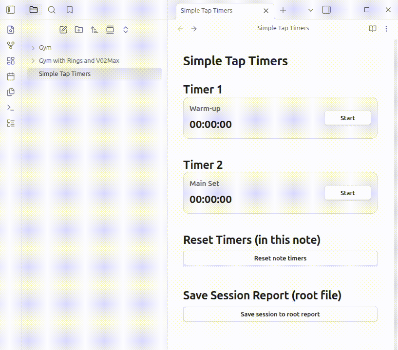

# Simple Tap Timer

Simple Tap Timer is an Obsidian plugin to run quick timers directly inside your notes.

## Demo
This demo shows timer usage, reset-all, and save-session flow.



## What it does
- Render interactive timers from markdown code blocks.
- Start/stop each timer with one tap.
- By default, only one non-independent timer can run at a time in the same note.
- Generate a timer summary table in the note.
- Reset all timers in the note.
- Save a session log to any folder/file path in your vault.

## Core timer block

Minimum usage (required only):
````markdown
```tap-timer
```
````

Fully customizable example:
````markdown
```tap-timer
title: Push-ups
id: pushups-timer
independent: false
startLabel: Start
stopLabel: Stop
errorNotice: Could not update timer.
```
````

### Timer parameters
- `id`: unique timer id (recommended).
- `title`: optional title shown above the timer.
- `independent`: `true`/`false` (default `false`).
  - `false`: when started, other non-independent timers in the same note are paused.
  - `true`: can run in parallel.
- `startLabel`: start button label.
- `stopLabel`: stop button label.
- `errorNotice`: message shown if timer action fails.

## Report block

Minimum usage (required only):
````markdown
```tap-timer-report
```
````

Fully customizable example:
````markdown
```tap-timer-report
button: Generate timer table
busyLabel: Generating...
missingNoteNotice: Could not identify the note to generate the table.
successNotice: Timer table generated/updated in the note.
errorNotice: Could not generate timer table.
reportTitle: Timer Summary
noteLabel: Note
updatedLabel: Updated
idHeader: ID
titleHeader: Title
valueHeader: Final Value
emptyLabel: (no timers)
```
````

This block inserts/updates a marked report section in the current note.

## Reset-all block

Minimum usage (required only):
````markdown
```tap-timer-reset-all
```
````

Fully customizable example:
````markdown
```tap-timer-reset-all
button: Reset note timers
busyLabel: Resetting...
confirm: This will reset all timers in this note. Continue?
missingNoteNotice: Could not identify the note to reset timers.
successNotice: Timers reset: {count}.
errorNotice: Could not reset timers.
```
````

## Save-session block

Minimum usage (required only):
````markdown
```tap-timer-save-session
```
````

Fully customizable example:
````markdown
```tap-timer-save-session
button: Save session
busyLabel: Saving...
confirm: This will save this session to the session log. Continue?
missingNoteNotice: Could not identify the note to save the session.
successNotice: Session saved to {log}. Total: {total}.
errorNotice: Could not save the session.
workout: Upper Body Day
folder: Logs
file: Sessions.md
historyTitle: # Timer Sessions History
sessionPrefix: Session
dateLabel: Date
dateIsoLabel: Date ISO
workoutLabel: Workout
noteLabel: Note
totalTimeLabel: Total time
sectionHeader: Section
idHeader: ID
timeHeader: Time
emptySectionLabel: (no timers)
```
````

### Save path options
You can configure destination in two ways:
- `folder` + `file` (recommended)
- `log` with a full vault-relative path (legacy/explicit override)

If `log` is provided, it takes precedence over `folder` + `file`.

## Notes for publishing and usage
- All defaults are in English.
- All user-visible labels/messages have generic defaults and can be overridden via block parameters.
- Legacy `next:` is not used anymore.
